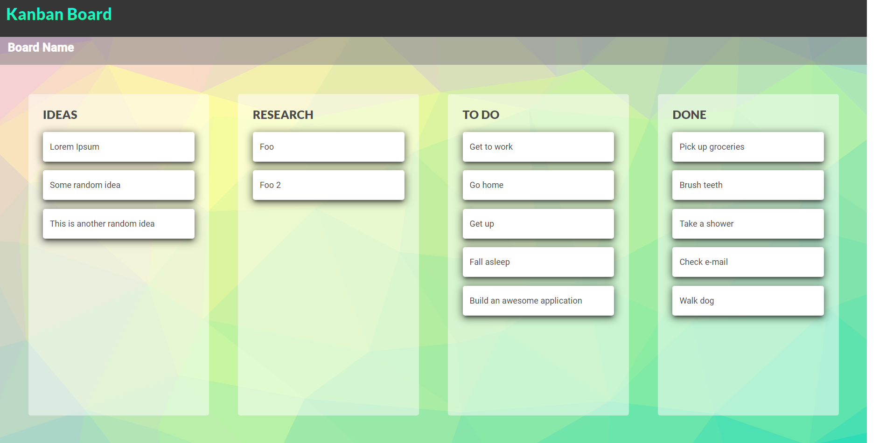

# Kanban with Draggable Cards

Neste projeto, criei um Layout Kanban com Cartões Arrastáveis usando o Angular Component Dev Kit (CDK).

O [Angular CDK](https://material.angular.io/cdk/categories) nos fornece "um conjunto de primitivas de comportamento para a construção de componentes de UI", incluindo um módulo de arrastar e soltar bem simples de usar chamado @angular/cdk/drag-drop, que utilizei para compor o layout do quadro Kanban da aplicação. 

Este projeto foi gerado com a versão 15.0.0 do [Angular CLI](https://github.com/angular/angular-cli). Também utilizei componentes prontos fornecidos pelo framework [Bulma](https://bulma.io/). Para criar fundos especiais, utilizei a ferramenta [Trianglify.io](https://trianglify.io/about).

## Development server

Run `ng serve` for a dev server. Navigate to `http://localhost:4200/`. The application will automatically reload if you change any of the source files.

## Code scaffolding

Run `ng generate component component-name` to generate a new component. You can also use `ng generate directive|pipe|service|class|guard|interface|enum|module`.

## Build

Run `ng build` to build the project. The build artifacts will be stored in the `dist/` directory.

## Running unit tests

Run `ng test` to execute the unit tests via [Karma](https://karma-runner.github.io).

## Running end-to-end tests

Run `ng e2e` to execute the end-to-end tests via a platform of your choice. To use this command, you need to first add a package that implements end-to-end testing capabilities.

## Further help

To get more help on the Angular CLI use `ng help` or go check out the [Angular CLI Overview and Command Reference](https://angular.io/cli) page.
